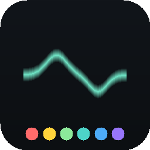

# Adi Ableton VST Controller

A master **VST controller** Stream Deck plugin for **Ableton Live**, targeting a
36-key / 6-dial / touchscreen device (SDK device type 13, also works on
Stream Deck +). It constantly tracks the **selected channel** and **selected
device** in Live and maps them to the dials, the touchscreen and the keys — with
a **generic mode** for any device (including external VST3 like Pulsar / Massive)
and **predefined per-VST layouts**, starting with **EQ Eight**.

Modular by design: every device layout is a `DeviceController` **Strategy**, so
adding a new VST is one small file + one registration line.

<p align="center"></p>

## What it does

- **Tracking** — follows `selected_track` → `selected_device` in Live in real
  time (parameter moves and automation update the touchscreen live).
- **Generic mode** (default) — maps the first **6 non-quantized** parameters of
  the selected device to the 6 dials; the touchscreen shows **6 zones**, one per
  dial, each with the parameter name + live value. Works on native devices and on
  VST2/VST3/AU plugins.
- **EQ Eight mode** (predefined) — overrides generic with a custom layout:
  - touchscreen **split exactly in half**: left = EQ response graph, right =
    per-band enable + cutoff-mode cells with **◀ ▶ pagination**;
  - the 6 dials control band **frequencies**; pagination shifts the focus window
    (bands 1-6 → 2-7 → 3-8); a dial press toggles its band.
- **EQ8 key** (one of the 36 keys, context-dependent):
  - **A** already on an EQ8 → focus the **next** EQ8 on the track;
  - **B** on a different device → focus the **closest** EQ8;
  - **C** no EQ8 on the track → **create** one;
  - **long-press** → open the **preset folder** on the other keys
    (short-press a preset = load onto the current EQ8; long-press = drop a **new**
    EQ8 with that preset).

## Repo layout

```
adi_ableton_vst_controller/
├── com.adiariel.ableton-vst.sdPlugin/    Stream Deck plugin (device type 13)
│   ├── manifest.json                     2 actions: VST Dial (Encoder), VST Key (Keypad)
│   ├── app.html                          plugin host (embedded Chromium)
│   ├── js/
│   │   ├── sd-client.js                  Elgato registration socket wrapper
│   │   ├── bridge.js                     Ableton WebSocket client + state store
│   │   ├── touchscreen.js                unified canvas → per-dial feedback slices
│   │   ├── keys.js                       36-key manager (EQ8 launcher + presets)
│   │   ├── plugin.js                     orchestrator
│   │   └── controllers/                  Strategy pattern
│   │       ├── DeviceController.js       base + registry + gfx
│   │       ├── GenericController.js      6-parameter mode
│   │       ├── EQ8Controller.js          EQ Eight split-screen
│   │       └── registry.js               strategy registration
│   ├── pi/                               Property Inspector (roles, slots, port)
│   └── layouts/dial.json                 encoder touchscreen layout
├── ableton/
│   ├── remote_script/AdiVST/             Python Remote Script (the bridge)
│   │   ├── __init__.py  AdiVST.py        control surface + main-thread command pump
│   │   ├── ws_server.py                  stdlib-only WebSocket server (RFC 6455)
│   │   └── live_bridge.py                all Live Object Model logic
│   └── max_for_live/                     M4L alternative (sketch)
├── demo/                                 hardware-free browser preview
├── scripts/                              gen_icons · validate · install · pack
├── docs/                                 PROTOCOL · ARCHITECTURE · ABLETON_SETUP
└── README · LICENSE · CHANGELOG · package.json
```

## How the requirements map to the code

| Requirement | Where |
|-------------|-------|
| Directory structure | this README + the tree above |
| Manifest for device type 13 | [`manifest.json`](com.adiariel.ableton-vst.sdPlugin/manifest.json) (Encoder + Keypad actions; type 13 detected at runtime via `AVC.SD.deviceOfType(13)`) |
| `DeviceController` base + `GenericController`/`EQ8Controller` inherit | [`js/controllers/`](com.adiariel.ableton-vst.sdPlugin/js/controllers) |
| Touchscreen Canvas (6 zones + EQ8 split) | [`GenericController.js`](com.adiariel.ableton-vst.sdPlugin/js/controllers/GenericController.js), [`EQ8Controller.js`](com.adiariel.ableton-vst.sdPlugin/js/controllers/EQ8Controller.js), [`touchscreen.js`](com.adiariel.ableton-vst.sdPlugin/js/touchscreen.js) |
| Server-side focus-shifting / counting / instantiation | [`live_bridge.py`](ableton/remote_script/AdiVST/live_bridge.py) (`cmd_eq8_key`, `_eq8_instances`, `_create_eq8`, presets) |
| Client-side WebSocket handlers | [`bridge.js`](com.adiariel.ableton-vst.sdPlugin/js/bridge.js), [`keys.js`](com.adiariel.ableton-vst.sdPlugin/js/keys.js) |

## Requirements

- Stream Deck app **6.5+**; **macOS 10.15+** or **Windows 10+**.
- **Ableton Live 11 or 12** (Python-3 Remote Scripts).

## Install

```bash
# macOS — installs the plugin AND the AdiVST Remote Script, restarts Stream Deck
./scripts/install-mac.sh
```
```powershell
powershell -ExecutionPolicy Bypass -File scripts\install-windows.ps1
```

Then in Live: **Settings → Link/Tempo/MIDI → Control Surface → AdiVST**. Full
steps, the presets folder and the VST3 "Configure" note are in
[docs/ABLETON_SETUP.md](docs/ABLETON_SETUP.md).

Set up the device in Stream Deck: drop **6 × VST Dial** across the dials and a
**VST Key** with role *EQ8 launcher*; add **VST Key**s with role *EQ8 preset slot*
(slots 0,1,2…) for the preset folder, and *track/device* nav keys as desired.

## Demo (no hardware / no Live)

```bash
python3 -m http.server 8799    # then open http://localhost:8799/demo/
```
Toggle EQ Eight / Generic, scroll a zone to turn a dial, click the EQ8 controls,
and click the EQ8 key to open the preset folder — all driven by the real
controller code with mock Live state.

## Extending — add a predefined VST

See [docs/ARCHITECTURE.md](docs/ARCHITECTURE.md#adding-a-predefined-vst-eg-pulsar--massive).
In short: subclass `AVC.DeviceController`, `<script>` it in `app.html`, and add
one `AVC.registry.register({ ctor: …, classNames: ['<LiveClassName>'] })`.

## Caveats (honest)

- Built against the documented Live Object Model; **runtime tuning in Ableton is
  expected** (this repo can't run Live). The WebSocket server, protocol, and all
  rendering are verified independently.
- The EQ graph is a **visual approximation** summed from the band parameters, not
  a bit-exact EQ8 transfer function.
- Preset "load onto current EQ8" is an insert-new-then-delete-old **replace** (Live
  API limitation — see ABLETON_SETUP).
- Device type 13 is detected at runtime; on Stream Deck + (4 dials) the layout
  uses the available dials.

## License

[MIT](LICENSE) © 2026 Adi Ariel. Not affiliated with Elgato/Corsair or Ableton.
