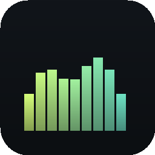

# Adi Visualizers &amp; Meters

A **Stream Deck** plugin that turns your dials (or keys) into live audio
instrumentation: a spectrum analyzer, oscilloscope, waveform, peak/RMS meters,
ISO octave bands, a goniometer (vectorscope) and stereo correlation/balance —
all driven by one real-time stereo capture.

Built for the **Stream Deck +** touchscreen (the strip is exactly 800 × 100 px,
so four dials reconstruct the full dashboard), and fully usable on any Stream
Deck key as well. Pure Web Audio + HTML5 Canvas, **zero runtime dependencies**.

<p align="center">
  
</p>

---

## Features

| View | What it shows |
|------|----------------|
| **Spectrum** | Log-frequency FFT with selectable window, block size, overlap, averaging time, pink-noise slope, frequency/dB ranges and fill. |
| **Oscilloscope** | Triggered time-domain trace (rising / falling / free), per-channel, with adjustable time base, amplitude and measurement cursors. |
| **Waveform** | Min/max envelope over a configurable window (Bitwig-style filled trace). |
| **Peak / RMS meters** | True per-channel RMS + peak with peak-hold ballistics, −60…+6 dBFS. Live **PEAK/RMS numbers always shown**; classic bars or **RME LED-segment style**. |
| **Octave bands** | Ten ISO bands (31 Hz…16 kHz), left & right side by side. |
| **RME analyzer** | DIGICheck-style: **27 × 1/3-octave segmented LED bands** (50 Hz…20 kHz) with yellow grid rows + the **RMS L / Peak / RMS R** meter trio with OVR strip — the reference layout in one view. |
| **Goniometer** | Stereo vectorscope with phosphor persistence (mono = vertical). |
| **Correlation** | Inter-channel phase: +1 mono, 0 wide, −1 out-of-phase. |
| **Balance** | Left/right RMS balance. |

All the precise per-sample L/R math (RMS, peak, correlation, balance) runs in an
**AudioWorklet**; the spectrum/scope/waveform/goniometer are computed on the
main thread from PCM ring buffers with a custom radix-2 FFT.

## How it works

```
getUserMedia(stereo, no DSP)
  └─ MediaStreamSource
       ├─ AudioWorkletNode "meter-processor"  → true L/R RMS, peak, correlation,
       │      balance + raw PCM frames  → ring buffers + METER
       └─ ChannelSplitter → AnalyserL / AnalyserR (octave bands)
```

One shared `AudioEngine` captures audio a single time. Each action instance gets
its own `Renderer` (independent FFT scratch, spectrum smoothing and meter
ballistics), so you can place the action on all four Stream Deck + dials with a
different view on each without them interfering. The plugin draws each view to an
offscreen canvas and pushes it to the device — `setImage` for keys, `setFeedback`
(a 200 × 100 pixmap) for the touchscreen.

The analysis/drawing code lives in
[`engine.js`](com.adi.visualizers-and-meters.sdPlugin/js/engine.js) and is shared
verbatim by the plugin and the browser demo.

## Requirements

- **Stream Deck app 6.5+** (the plugin targets SDK v2).
- **macOS 10.15+** or **Windows 10+**.
- A stereo audio **input**. `getUserMedia` captures an *input* device, not system
  output — see [Capturing system audio](#capturing-system-audio).

## Install

### From source (development)

```bash
# macOS — symlink into Stream Deck and restart it
./scripts/install-mac.sh           # or:  ./scripts/install-mac.sh copy
```

```powershell
# Windows (PowerShell)
powershell -ExecutionPolicy Bypass -File scripts\install-windows.ps1
```

Both scripts validate the manifest, drop the `.sdPlugin` folder into Stream
Deck's plugins directory and relaunch the app. Plugin locations:

- macOS — `~/Library/Application Support/com.elgato.StreamDeck/Plugins/`
- Windows — `%APPDATA%\Elgato\StreamDeck\Plugins\`

### Packaged `.streamDeckPlugin` (distribution)

Install Elgato's **DistributionTool** ([SDK downloads](https://docs.elgato.com/streamdeck/sdk/)),
then:

```bash
./scripts/pack.sh                  # macOS / Linux  → release/*.streamDeckPlugin
powershell -File scripts\pack.ps1  # Windows
```

Double-click the resulting `.streamDeckPlugin` to install.

## Usage

1. Drag **Audio View** onto a key or a Stream Deck + dial.
2. Open the action's settings (Property Inspector) to pick the view and tune it.
3. On a real Stream Deck:
   - **Press a key** / **press a dial** → cycle to the next view.
   - **Tap the touchscreen** → place the **tap readout** for the current view
     (see below).
   - **Rotate a dial** → adjust the view's main parameter (spectrum → averaging
     time, scope → time base, waveform → window length).
   - **Long-touch** the touchscreen → clear the readout (reset the view to
     defaults when none is shown).
4. **Refresh rate** and **input device** are shared across all instances and set
   once in any action's Property Inspector (default 15 fps; 5–30).

### Tap readout (every view)

Tapping the touch strip shows a header readout for the tapped spot — the
marker auto-hides after **Readout hold** seconds (default 6, per view):

| View | Tap shows |
|------|-----------|
| **Spectrum** | SPAN's mouse-hover readout: **frequency, nearest note ± cents, level** — e.g. `110Hz A2 ±0¢ -18.2dB` — with a hairline + dot on the curve |
| **Scope** | time from trigger + the **equivalent period frequency + note** (tap one cycle in to read the pitch) + level at that instant |
| **Waveform** | how far back that moment is (`-380ms`) + that column's peak level |
| **Octave bands** | tapped band's center frequency, nearest note, live L/R levels (band highlighted) |
| **RME analyzer** | tap a band → its frequency, note and level; tap the meter side → exact PEAK/RMS numbers |
| **Meters** | *no tap needed* — live PEAK/RMS numbers are always shown next to the bars |
| **Goniometer** | live correlation + balance numbers |
| **Correlation / Balance** | *no tap needed* — the exact value is always shown |

Compensations for the small 200 × 100 touch slot (spectrum):

- **Snap to peak** (default on): the tap snaps to the strongest column within
  ~±8 px, so touching *near* your kick reads the kick, not the valley next to
  it. Toggle in the Property Inspector.
- **True-peak frequency**: the readout refines the coarse 200-column grid to
  the actual FFT peak bin with parabolic interpolation — sub-Hz accuracy at
  110 Hz instead of the ~60-cent column quantization.
- The readout text scales with the surface. **Tuning A4** (440 / 442 / 432)
  sets the note reference on the spectrum, scope and bands views.

> The very first time, grant Stream Deck microphone access when the OS prompts
> (macOS: System Settings → Privacy & Security → Microphone → enable Stream Deck).

## Capturing system audio

`getUserMedia` records an input device. To analyze what's *playing*, install a
loopback device and select it as the input in the Property Inspector:

- **Windows** — [VB-Cable](https://vb-audio.com/Cable/) (set it as the playback
  device, then choose it as the plugin input).
- **macOS** — [BlackHole](https://existential.audio/blackhole/) (route output
  through it, or use a Multi-Output Device to keep hearing audio).

## Browser demo (no hardware needed)

The original 800 × 100 strip prototype runs in any browser and shares the plugin
engine:

```bash
python3 -m http.server 8777
# open http://localhost:8777/demo/
```

Click **Start analyzer**, tap the left canvas to cycle spectrum / scope /
waveform, and use the gear for settings. (Serve over `http://localhost` — mic
access is blocked on `file://`.)

## Project structure

```
adi_visualizers_and_meters/
├── com.adi.visualizers-and-meters.sdPlugin/   # the installable plugin
│   ├── manifest.json                          # SDK v2 manifest (mac + windows)
│   ├── app.html                               # plugin host page (CEF runtime)
│   ├── js/
│   │   ├── engine.js                          # shared DSP + audio + drawing
│   │   └── plugin.js                          # Stream Deck bridge + render loop
│   ├── pi/                                     # Property Inspector (settings UI)
│   │   ├── inspector.html / inspector.js / sdpi.css
│   ├── layouts/visualizer.json                # encoder touchscreen layout
│   └── imgs/                                   # generated icons (@1x + @2x)
├── demo/                                       # hardware-free browser preview
│   ├── index.html / demo.js / styles.css
├── scripts/                                    # icons, validate, install, pack
├── docs/
├── package.json   LICENSE   CHANGELOG.md   README.md
```

## Development

```bash
python3 scripts/gen_icons.py     # regenerate icons (stdlib only, no Pillow)
python3 scripts/validate.py      # check manifest + that every asset exists
```

- The plugin runs inside Stream Deck's embedded Chromium, so the same Web Audio
  / Canvas code works there and in the browser demo.
- `engine.js` exposes a single global, `window.AVM`, so there's no bundler or
  build step.
- To debug the running plugin, enable the Stream Deck HTML debugger and open
  `http://localhost:23654/` while Stream Deck is running.

## Troubleshooting

- **Blank / black view** — no signal on the selected input, or mic permission
  was denied. Check the input device in the Property Inspector and the OS privacy
  settings.
- **Plugin doesn't appear** — run `python3 scripts/validate.py`; Stream Deck
  ignores a plugin whose manifest references a missing file. Make sure the folder
  is named exactly `com.adi.visualizers-and-meters.sdPlugin`.
- **High CPU** — lower the refresh rate, or use fewer/smaller FFT block sizes.

## License

[MIT](LICENSE) © 2026 Adi Ariel.

Not affiliated with or endorsed by Elgato/Corsair. "Stream Deck" is a trademark
of Corsair Memory, Inc.
